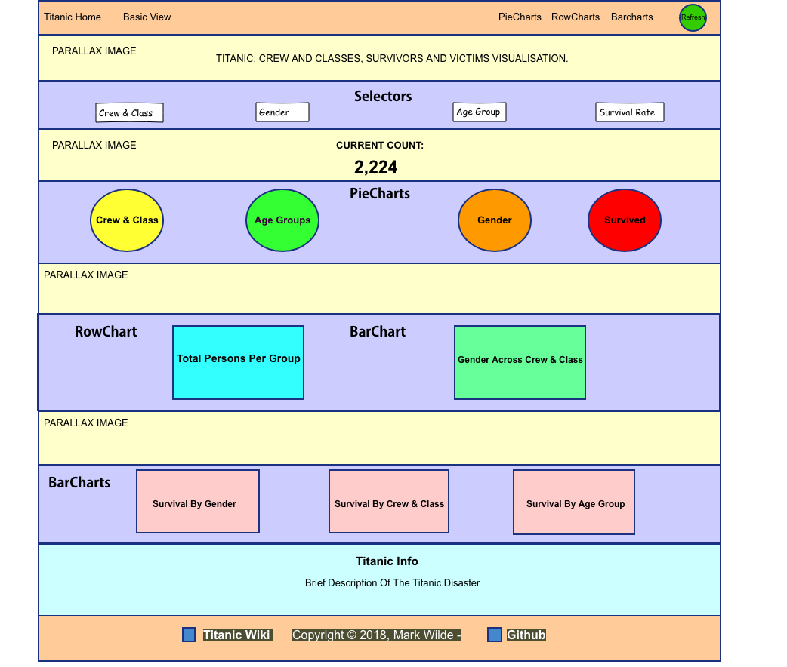

# The Animals Website

### Code Institute: User Centric Front End Development Milestone Project

<a href="https://markwilde33.github.io/CI-project-two/" target="_blank"> Click here to view website</a>

*Developer: Mark Wilde*

-------


## Index


1. [Project Instructions](#instructions-from-code-institute)
2. [Purpose](#purpose)
3. [UX](#ux)
    * [Wireframes](#wireframes)
    * [Design](#design)
    * [User Stories](#user-stories)
4. [Features](#features)
5. [Technologies](#technologies-used)
6. [Testing](#testing)
7. [Deployment](#deployment)
8. [Installation](#installation)
9. [Credits](#credits)


## Instructions From Code Institute


Guidelines for project development:

- Build a data dashboard that visualizes a dataset of your choice.
- Visualize your data using D3.js and dc.js.
- Create a Single-Page Application.
- Incorporate links or buttons to allow your user to navigate the site and reset/control the site functionality
- Create a website of around 4-5 pages.
- Incorporate main navigation and grid layout.
- Whenever possible, strive to use semantic HTML5 elements to structure your HTML code better.
- Make sure your site is as responsive as possible. You can test this by checking the website on different screen sizes and browsers.
- We advise that you write down user stories and create wireframes/mockups before embarking on full-blown development.
- The site can also make use of CSS frameworks such as Bootstrap.
- You should conduct and document tests to ensure that all of your websites functionality works well.
- Write a README.md file for your project.
- Use Git & GitHub for version control.
- Deploy the final version of your code to a hosting platform such as GitHub Pages.


## Purpose

This website provides statistical information about the passengers and crew of the [RMS Titanic](https://en.wikipedia.org/wiki/RMS_Titanic/) in the form of data visualization using open source Javascript libraries.

It is a simplistic static website that's focuses on telling the story of those on board through various data models. It is concerned with four distinct areas:

1. Crew & Classes
2. Gender
3. Adults & Children
4. Survival Rates

 
 
 
## UX


### Wireframes

[Balsamiq](https://balsamiq.com/) was used to create the wireframes.

<details>
      <summary><strong><em>Titanic Home</em></strong></summary>
  
  
  
</details> 

<details>
   <summary><strong><em>Basic View</em></strong></summary>
  
 
  
</details> 


### Design


- The website incorporates some parallax images between the data chart sections to give the users a more in depth experience.

- It was decided to include a second basic view page so that users can view the data charts in isolation. They are much closer together in basic view mode. The reasoning behind this decision was that perhaps some users might enjoy seeing the data charts working in unison as they click on the various interactive charts.

- A simple navbar and footer were implemented. The navbar includes scroll spy so that a user can click on a heading and be brought to  that section.The footer includes a link to the titanic wiki page and this websites github repository.

- There is a refresh button in the navbar so that users can reset all graphs at any time. They may wish to start over and work through the interactive charts again.
  
- The Bootstrap framework underpins the project and was implemented as per convention.

- The project implemented D3.js, DC.js, Queue.js and Crossfilter.js to build the data charts .

- The websites color scheme and layout were chosen so as to give the website some personality and to make the data charts more visceral and visually appealing.

- The pictures and art where chosen to tell a visual narrative with regards the Titanic. With the pictures showing various stages of the Titanic's journey from beginning to end.


### User Stories


Several user stories were considered before development began:

1. "As someone who is interested in the Titanic disaster, I would like to be able to visit a website and be presented with official statistics regarding those onboard."

2. "As someone who is interested in the Titanic disaster, I would like to view data visualization charts representing key statistics of those onboard, to help me visualize the factors at play; and get a feel for the numbers involved. For example, what was the ratio of men to women? How many third class children survived the disaster?, and so on."

3. "As someone who is interested in the Titanic disaster, I would appreciate having access to a simple, easy to navigate website. Where I can explore some of the key facts underpinning in the disaster.
 
4. I would also appreciate some images of the Titanic being displayed on the website, to help ignite my imagination."

5. "I would appreciate a link to further, more in depth information about the titanic, to be included on the website."

6. "If possible I would like to feel some enthusiasm while clicking through the data charts and watching them dynamically interact. It is hoped that I may garner insights, or discover a narrative I may not have been aware of, before visiting the website."


## Features


| Page      | Description                                                                                                                                                                                         |
| :-------- | :-------------------------------------------------------------------------------------------------------------------------------------------------------------------------------------------------: |
| Titanic Home       | The main page which features a collection of data charts informing the Titanic disaster. Also included are various parallax images of the Titanic. It implements scroll spy functionality. There is brief description of the Titanic disaster, a navbar with section links and a refresh button, and a footer.                                 |
| Basic View     | This page is a stripped down version on the main page. It only displays the data charts, navbar and footer. There is a small; change in the navbar links. As they are all positioned closer together; users can enjoy viewing the interaction across the charts as they click on there various components |


## Existing/Future Technologies


- A page hosting a robust photo collection of the Titanic.
- A page hosting personal stories about some of the passengers who perished at sea, and those who survived the disaster.


## Technologies Used


### Integrated Development Environment


- [Cloud9](https://aws.amazon.com/cloud9/?origin=c9io)
    - The project was developed using the **Cloud9** Integrated Development Environment.


### Front End


- [HTML](https://www.w3schools.com/html/default.asp)
    - The project uses **HTML** to create the pages.

- [CSS](https://www.w3schools.com/css/default.asp)
    - The project uses **CSS** to style the pages.

- [Bootstrap CSS Framework](https://getbootstrap.com/)
    - The project uses **Bootstrap** for styling and responsive design.

- [FontAwesome Icons](https://fontawesome.com/)
    - The project uses **FontAwesome** for the social media icons and the navbar buttons.
    
- [JQuery](https://jquery.com)
    - The project uses Bootstrap's **JQuery** for responsiveness.
 
- [D3.js](https://d3js.org/)
    - The project uses **D3.js** for manipulating documents based on data.

- [Dc.js](https://dc-js.github.io/dc.js/)
    - The project uses **DC.js** to leverage d3 and render charts in CSS-friendly SVG format.

- [Crossfilter.js](http://square.github.io/crossfilter/)
    - The project uses **Crossfilter.js** for fast multidimensional filtering for coordinated views.

- [Queue.js](https://caolan.github.io/async/queue.js.html)
    - The project uses **Queue.js** for loading multiple files before running the rest of the code.


### Version Control


- The project uses [Git](https://git-scm.com) as it's version control system.
  
- The project uses  a  [Github](https://github.com) repository.

   
   
    
## Testing


<details>
      <summary><strong><em>User Story Tests</em></strong></summary>

#### User Tests:

1. Verify a site visitor will be presented with data charts informed by official statistics regarding those onboard.
2. Verify that a site visitor can view data charts representing key statistics of those onboard, such as the number of third class children who survived the disaster.
3. Verify that a site visitor has access to a simple, easy to navigate website. Where they may explore some of the key facts underpinning in the disaster.
4. Verify that potential fans of the band can access some of the bands best material for free.
5. Verify that a site visitor can observe images of the Titanic, to help ignite their imagination.
6. Verify that a site visitor has the potential to feel enthusiastic while navigating the charts. And could potentially discover new narratives in their personal understanding of the disaster.

</details> 


<details>
      <summary><strong><em>Manual Tests</em></strong></summary>

  
#### Titanic Home Page:
   
1. Open the app.
2. Click on each of the five links in the navbar and verify each one is working as intended, i.e., when the user clicks the basic view link he/she is taken to the basic view page.
3. Verify that the scroll spy functionality is working correctly. Click on each link and check that the page scrolls to the correct section.
4. Verify that each parallax image is loading and working as intended.
5. Verify that the selector boxes are displaying the correct information, and that the icons above each selector box are displaying.
6. Verify that the number box is functioning correctly, and that the current count changes depending on the selected criteria.
7. Verify that the piecharts are displaying and functioning as intended, interacting dynamically with all other charts.
8.  Verify that the rowchart is displaying and functioning as intended, interacting dynamically with all other charts.
9. Verify that the barcharts are displaying and functioning as intended, interacting dynamically with all other charts.
10. Verify that the Titanic info section is displaying as intended, and contains no grammatical errors.
11. Verify that each link in the footer is working as intended, users will be taken to the relevant web page when they click on a link.
12. Verify that the refresh the page icon in the navbar is working as intended, The page will refresh on one click.
13. Verify custom styles are working as intended, for example, the charts should change position across various screen sizes.
14. Verify that the navbar links change color when the cursor is hovered over them.
15. Verify that the footer links change color when the cursor hovers over them.


#### Basic View Page:
   
1. Open the app, navigate to the basic view page.
2. Click on each of the five links in the navbar and verify each one is working as intended, i.e., when the user clicks the basic view link he/she is taken to the basic view page.
3. Verify that the scroll spy functionality is working correctly. Click on each link and check that the page scrolls to the correct section.
4. Verify that the selector boxes are displaying the correct information, and that the icons above each selector box are displaying.
5. Verify that the number box is functioning correctly, and that the current count changes depending on the selected criteria.
6. Verify that the piecharts are displaying and functioning as intended, interacting dynamically with all other charts.
7.  Verify that the rowchart is displaying and functioning as intended, interacting dynamically with all other charts.
8. Verify that the barcharts are displaying and functioning as intended, interacting dynamically with all other charts.
9. Verify that each link in the footer is working as intended, users will be taken to the relevant web page when they click on a link.
10. Verify that the refresh the page icon in the navbar is working as intended, The page will refresh on one click.
11. Verify custom styles are working as intended, for example, the charts should change position across various screen sizes.
12. Verify that the navbar links change color when the cursor is hovered over them.
13. Verify that the footer links change color when the cursor hovers over them.


<details>
      <summary><strong><em>Miscellaneous</em></strong></summary>


### Further Testing


- [Google Chrome Devtools](https://developers.google.com/web/tools/chrome-devtools/) where used at every stage of production to isolate issues and improve mobile responsiveness.
- The app has been tested on various browsers, including Chrome, Firefox, Opera, and Safari.
- The app was tested across many screen sizes, from very small to very large.
- Some family members tested the app on their own devices and their recommendations, such as which Titanic images to use, were taken on board.
- The app is displaying as intended across various devices and in different browsers.


### Issues


- CSS flexbox could of been utilized more efficiently, in place of an over reliance on media queries when positioning elements across various screen sizes.

- The guidelines specified a single page application should be used. However, as documented above, it was felt that including a basic view page would be useful for some users, without adding any complication to user experience.

- While utilising the scroll spy functionality in the basic view page the navbar slightly covers over the top of the selected section. This may be irritating for some users.


</details> 


## Deployment


The website has been deployed to [Github Pages](https://pages.github.com/) and can be accessed [here](https://markwilde33.github.io/CI-project-two/)

This project has been saved to a Github repository from the beginning of development. Hosting it to Github Pages was very straightforward. In the repository, from the settings menu, Github Pages was activated and the master branch was included as the source. A message is then generated by Github containing the following information and: Your site is published at https://markwilde33.github.io/CI-project-two/

In my case, as with a previous project, clicking on the link returned a 404 error. A fix for this issue can be found at [Stackoverflow](https://stackoverflow.com/questions/11577147/how-to-fix-page-404-on-github-page), here are the instructions:

``` 
<!-- input the following commands in your terminal -->

$ git commit --allow-empty -m "Trigger rebuild"

$ git push
```
This corrected the error and the website loaded as intended.


## Installation


``` 
from the console type:

$ git clone https://github.com/markwilde33/CI-project-two.git
$ cd CI-project-one

Open index.html in your web browser.
```
App available at http://127.0.0.1:5000/


## Credits


[Code Institute](https://codeinstitute.net/)

The Html Fundamentals Module, Css Fundamentals Module, JavaScript Fundamentals  Module and the Interactive Front End Development Module were used for guidance.


### Content

- [Wikipedia](https://en.wikipedia.org/wiki/RMS_Titanic) was used for researching the Titanic.

- [Titanic data](https://en.wikipedia.org/wiki/Passengers_of_the_RMS_Titanic#/media/File:Titanic_casualties.svg) provided by the British Board of Trade was used to create a CSV file. As the author was unable to acquire a CSV file which contained the information he wished to present, a CSV file was created specifically for this project. This process took considerably longer than had been originally hoped.


### Media

- [wallhere](https://wallhere.com/en/wallpapers?q=titanic) was used for Titanic pictures and images.


### Acknowledgements

- I received inspiration for this project from [Code Institute](https://codeinstitute.net/), [The Net Ninja](https://www.thenetninja.co.uk), [Brad Traversy](https://www.traversymedia.com/) and [Corey Schafer](https://www.youtube.com/user/schafer5/featured).